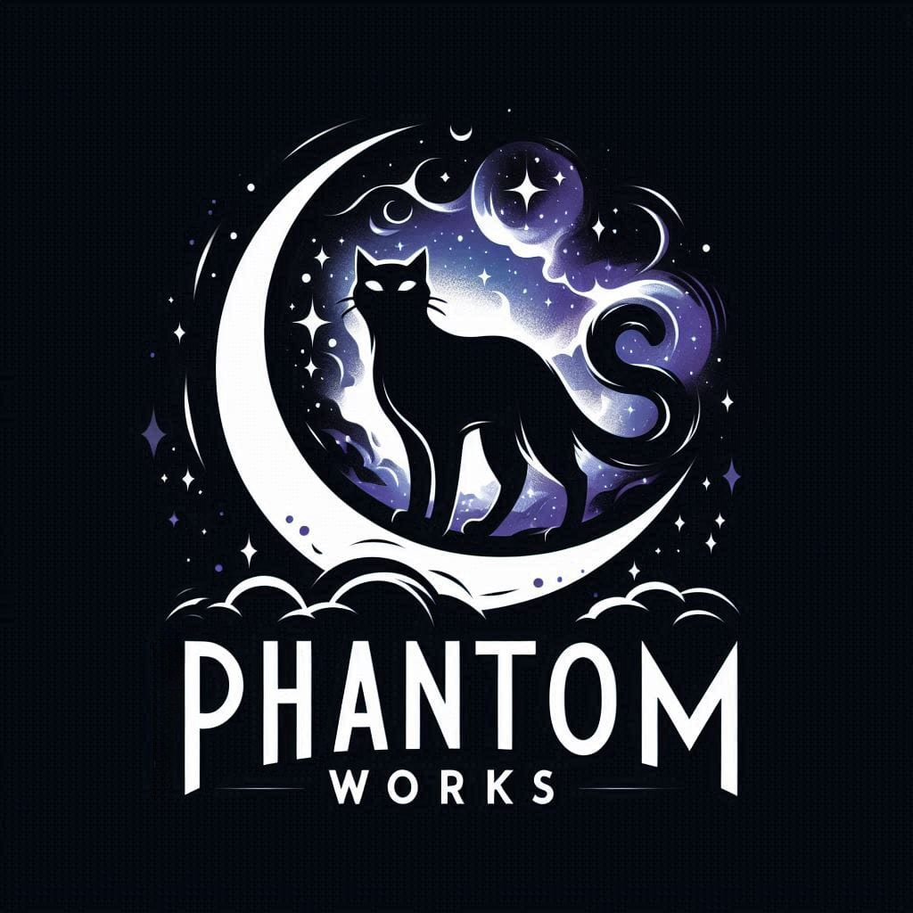

<h1>ClassConnect</h1>

   

## 📄 Description

ClassConnect is an innovative educational platform that blends the traditional learning
hub with a 3D learning environment. Its primary objective is to leverage cutting-edge
and emerging 3D technologies to enrich learning experiences. This is achieved by
enabling students to interact with 3D models that correspond to their study material.
This interactive approach not only fosters a deeper understanding of the subject matter
but also ensures that the learning experience is memorable. In essence, ClassConnect
is revolutionising education by making learning more immersive and engaging.

## 📁 Documentation

- [SRS Document](https://drive.google.com/file/d/1_EG2l7GWTb_-C0pbum3-EAEQ1Ve1242p/view?usp=sharing)

## 🎬 Demo Video

- [Demo 1 Video](https://drive.google.com/file/d/1AJAgftIAKCBaGVa4KQGHvoX01R3dvBUb/view?usp=sharing)

## 🔧 Technologies

    

## 📋 Project Management

[Project Board](https://github.com/orgs/COS301-SE-2024/projects/80)

## 👥 Team Members

| Name           | Profile Picture                                                                                                    | Role              | Socials                                                                                                                                                                                           |
| -------------- | ------------------------------------------------------------------------------------------------------------------ | ----------------- | ------------------------------------------------------------------------------------------------------------------------------------------------------------------------------------------------- |
| **Joshua Wereley** |  | Project Manager   |   |
| **Ashley Kapaso**  |  | Architect         |   |
| **Eugene Mpande**  |  | DevOps Engineer   |   |
| **Lunga Ndlovu**   |    | Frontend Engineer |   |
| **Ayanda Juqu**    |  | Backend Engineer  |   |

## ✉️ Contact

### phantomworks.capstone@gmail.com

  

